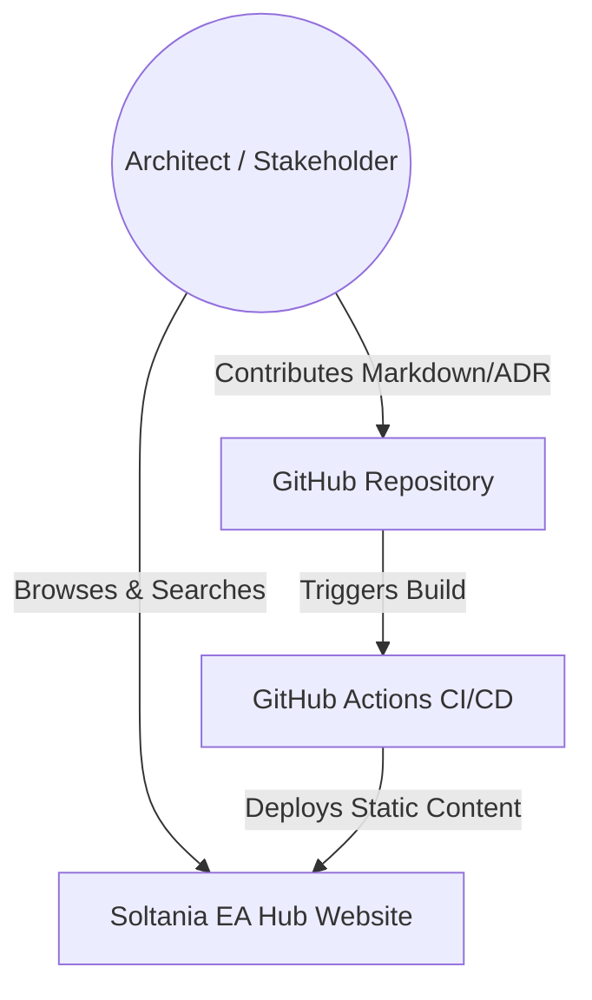

# Software Design Document: Soltania Enterprise Architecture Hub

## 1. Project Purpose
The Soltania Enterprise Architecture (EA) Hub serves as the centralized, single source of truth for architectural standards, blueprints, and governance processes. It aims to bridge the gap between high-level business strategy and technical implementation by providing stakeholders with searchable, version-controlled documentation.

## 2. Information Architecture

### 2.1 Cloud Architecture
- **Hosting:** GitHub Pages (Static Hosting).
- **CDN:** Integrated GitHub/Fastly edge caching for global performance.
- **Environment:** Production branch (`main`) and Staging/Preview via Pull Requests.

### 2.2 Security Architecture
- **Authentication:** Integrated with GitHub Organization SSO (SAML/OIDC).
- **Authorization:** Role-based access control (RBAC) via GitHub Team permissions (Read/Write/Admin).
- **Integrity:** Branch protection rules requiring peer reviews for all architectural changes.

### 2.3 Data Architecture
- **Storage:** Flat-file Markdown structure organized by domain (e.g., `/docs/infrastructure`, `/docs/applications`).
- **Metadata:** YAML Frontmatter used for indexing, tagging, and lifecycle management (e.g., `status: draft|approved|deprecated`).
- **Versioning:** Git-based history for full audit trails of architectural decisions.

### 2.4 Governance Framework
- **Architecture Review Board (ARB):** Workflows triggered via GitHub Issues and Pull Requests.
- **Compliance:** Automated linting for documentation standards and link integrity.

## 3. Static Site Generation (SSG) & Visual Strategy

### 3.1 Tooling & Rendering
- **Engine:** MkDocs (with Material theme) or Jekyll.
- **Visual Standard (Diagrams-as-Code):** All architectural diagrams must be authored using **Mermaid.js** syntax. 
- **Integration:** The SSG engine is configured to render `mermaid` code blocks into SVG components automatically during the build process.

### 3.2 C4 Model Implementation
We follow the **C4 Model** (Context, Containers, Components, Code) for visualizing software architecture levels. Below is the **Level 1: System Context** diagram for this repository:



### 3.3 Deployment Pipeline

1. **Commit:** Architect pushes Markdown changes to a feature branch.
2. **CI/CD:** GitHub Actions triggers a build process.
3. **Validation:** Markdown-lint, internal link checkers, and Mermaid syntax validation.
4. **Publish:** Upon merge to `main`, the site is automatically deployed to the `gh-pages` branch.

## 4. Required Markdown Templates

To ensure consistency across the hub, the following templates are required in the `.github/templates` directory:

| Template Name | Purpose | Key Sections |
| --- | --- | --- |
| **ADR-Template** | Architecture Decision Records | Context, Decision, Consequences, Status |
| **System-Design** | New System/Service specs | Components, Data Flow, Integration Points |
| **API-Standard** | Documenting REST/GraphQL APIs | Endpoints, Auth, Rate Limits, Schema |
| **Security-Policy** | Domain-specific security rules | Threat Model, Encryption, Compliance |
| **Infrastructure-Pattern** | Cloud resource blueprints | Terraform/Bicep snippets, Cost estimates |

## 5. Directory Structure

```text
soltania-ea-hub/
├── .github/             # Workflows and Templates
├── docs/
│   ├── adr/             # Architecture Decision Records
│   ├── blueprints/      # Visual and technical designs
│   ├── governance/      # Policies and standards
│   └── roadmap/         # Future state architecture
├── assets/              # Images and diagrams (Mermaid/SVG)
├── mkdocs.yml           # SSG Configuration
└── README.md            # Project entry point

```