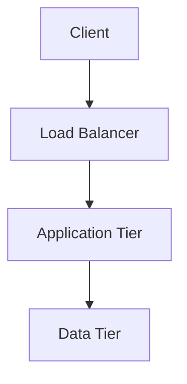

# CAP-XXX: [Pattern Name]

## 1. Executive Summary
Provide a high-level overview of the architecture pattern and the specific business or technical problem it solves within the Soltania ecosystem.

## 2. Pattern Description
Detailed description of the architectural approach. 

### 2.1 Visual Diagram

*Insert link to high-resolution SVG or LucidChart if applicable.*

## 3. Components & Responsibilities
| Component | Technology Recommendation | Responsibility |
| :--- | :--- | :--- |
| Entry Point | e.g., Azure Front Door | Global routing and WAF |
| Compute | e.g., AKS / Lambda | Business logic execution |
| Storage | e.g., CosmosDB | State persistence |

## 4. Design Principles & Constraints
*   **Scalability:** How does this pattern handle horizontal/vertical growth?
*   **Resiliency:** High Availability (HA) and Disaster Recovery (DR) strategy.
*   **Security:** Identity (IAM), Encryption at rest/transit, and Network isolation.
*   **Cost:** Estimated cost impact and optimization levers.

## 5. Implementation Guidance

### 5.1 Infrastructure as Code (IaC)
```hcl
# Example Terraform Snippet
resource "azurerm_resource_group" "example" {
  name     = "rg-soltania-pattern"
  location = "West Europe"
}
```

### 5.2 Configuration Standards
*   Naming conventions to follow: `solt-<env>-<region>-<service>-##`
*   Required tags: `Owner`, `CostCenter`, `Environment`.

## 6. Known Limitations
*   List any scenarios where this pattern should **not** be used.
*   Performance bottlenecks or service quotas to monitor.

## 7. Related ADRs & Standards
*   [ADR-001: Cloud Provider Selection](../adr/adr-001.md)
*   [SEC-POL-05: Data Encryption Standard](../governance/security-policy-05.md)

---
*Generated by Soltania Enterprise Architecture Hub Governance Framework.*